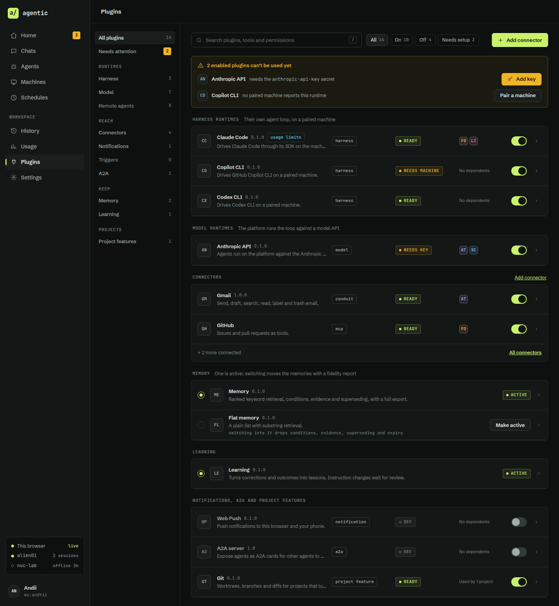
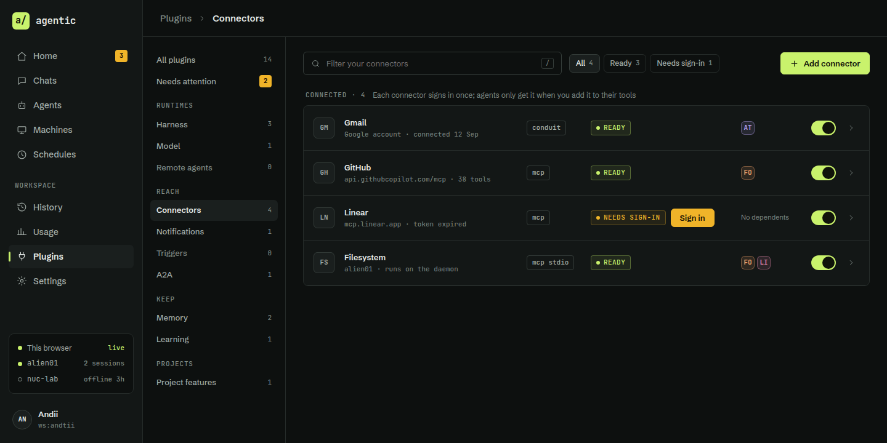
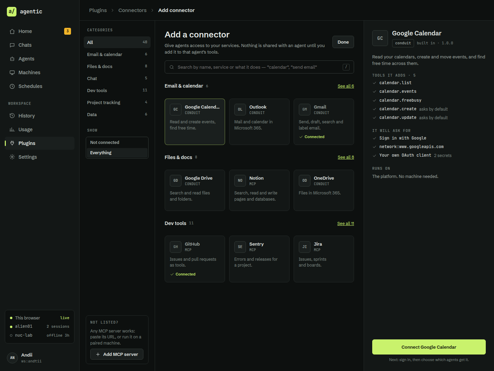
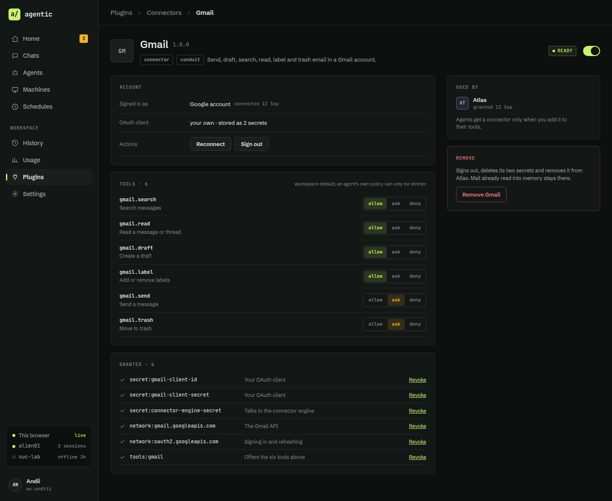

# Plugins redesign — design handoff

Sep 24, 2026 · vendored for [#625](https://github.com/andtii/agentic/issues/625) by [#626](https://github.com/andtii/agentic/issues/626)

This is the plugins part of the Agentic UI handoff: the `## Plugins` section of the handoff verbatim, plus the design tokens and app component tables it uses. The rest of the handoff is [`../HANDOFF.md`](../HANDOFF.md). The four boards and their screenshots sit beside this file; the live canvas is https://claude.ai/artifact/3eEJpPfwQdxsH5GtGJtw87.

All names, accounts and counts on the boards are invented sample data. Copy the structure, not the content.

| Artboard | Route | Size | Screenshot | Source |
| --- | --- | --- | --- | --- |
| `Plugins` | `/plugins?kind=&status=&q=` | 1440 × 1560 | [`screenshots/Plugins.png`](screenshots/Plugins.png) | [`artboards/Plugins.dc.html`](artboards/Plugins.dc.html) |
| `PluginsConnectors` | `/plugins?kind=connector` | 1440 × 720 | [`screenshots/PluginsConnectors.png`](screenshots/PluginsConnectors.png) | [`artboards/PluginsConnectors.dc.html`](artboards/PluginsConnectors.dc.html) |
| `AddConnector` | `/plugins/connectors/add?category=&q=&selected=` | 1440 × 1080 | [`screenshots/AddConnector.png`](screenshots/AddConnector.png) | [`artboards/AddConnector.dc.html`](artboards/AddConnector.dc.html) |
| `PluginDetail` | `/plugins/:id` | 1440 × 1180 | [`screenshots/PluginDetail.png`](screenshots/PluginDetail.png) | [`artboards/PluginDetail.dc.html`](artboards/PluginDetail.dc.html) |

The artboards are static HTML with inline styles, so exact measurements can be read from them. They reference the canvas runtime (`support.js`, not vendored), so open them in the design canvas, or strip that script tag to view them in a browser. [`tokens.json`](tokens.json) is the tokens table below in machine-readable form.

The routes, the policy chain and the readiness status are specified in [`docs/architecture.md`](../../architecture.md) §9 ("Target — plugins redesign") and §10.

## Plugins

The plugins area replaces the three-column card catalogue with a category menu, compact rows, and separate pages for connected connectors, adding a connector, and each plugin. Card grids stop working once there are dozens of connectors; this layout keeps the main page the same length however many are added. Boards: `Plugins` (1440 × 1560), `PluginsConnectors` (720), `AddConnector` (1080), `PluginDetail` (1180).

### Routes

| Route | View | Replaces in `apps/web/src/pages` |
| --- | --- | --- |
| `/plugins?kind=` | All plugins, or one category | `Plugins.tsx` + `plugins/PluginCatalogue.tsx` |
| `/plugins?kind=connector` | Connectors you have | `plugins/LiveConnectors.tsx` |
| `/plugins/connectors/add?category=&q=&selected=` | Add a connector | `plugins/AddConnectorDialog.tsx` becomes this page |
| `/plugins/:id` | One plugin | `Plugin.tsx` + `plugins/PluginDetail.tsx` |

### All plugins

| Part | Spec |
| --- | --- |
| Category menu | 232 px, left of the content. Built from `KIND_ORDER` with runtimes split by `RUNTIME_KIND_ORDER`, grouped as Runtimes (Harness, Model, Remote agents), Reach (Connectors, Notifications, Triggers, A2A), Keep (Memory, Learning), Projects (Project features). 34 px items with a mono count; empty categories show `0` in `text-dim` and stay clickable. Two items on top: All plugins, and Needs attention with an amber count badge. Selecting one sets `?kind=` |
| Search | 440 px, `/` focuses it. Matches name, description, id, tool names and permission scopes (`network:`, `secret:`), so "googleapis" finds Gmail |
| Status chips | All, On, Off, Needs setup, with counts. Combine with the category and search |
| Needs attention | Shown when any enabled plugin's `pluginReadiness` is not `ready`. One line per plugin: tile, name, what it needs in words, and the fix as a button: `needs-secret` → Add key, `needs-machine` → Pair a machine, `needs-config` → Configure, `needs-grant` → Grant, `no-kek` → a link to the deployment docs |
| Group | Mono label + one-line note (the existing `RUNTIME_KIND_NOTE`), then a bordered list |
| Row | 60 px grid `36px 1fr 150px 150px 120px 44px 20px`: 32 px monogram tile, name + version + feature tags (`usage limits`) over a one-line description, kind tag, readiness pill, dependents as agent tiles (or "Used by 1 project", "No dependents"), switch, chevron. The whole row links to `/plugins/:id`; the switch stops propagation |
| Single-slot kinds | Memory and Learning (`SINGLE_SLOT_KINDS`) render as a radio list: the active one has an `ACTIVE` pill, the others a `Make active` button. For memory, the row says what a switch drops (the fidelity report), and Make active opens the existing confirm with the migration report |
| Connectors group | Shows the first two connected, then "+ N more connected" and a link to the Connectors view. Never lists the catalogue |

Readiness pill mapping from `PluginReadinessStatus`: `ready` → READY (`live`); `disabled` → OFF (hollow, `text-dim`); `needs-secret` → NEEDS KEY, `needs-machine` → NEEDS MACHINE, `needs-config` → NEEDS SETUP, `needs-grant` → NEEDS GRANT, all `needs-you`; `no-kek` → NO KEY STORE (`needs-you`). `needs-sign-in` → NEEDS SIGN-IN (`needs-you`): a connector whose sign-in has expired. It is a core `PluginReadinessStatus` fed by a readiness fact (decided 2026-09-24, below).

What moves off the row: the granted permission list, "Declared, not granted" and the disabled-consequence text all move to the plugin page. The row keeps only what you need to decide whether to open it.

### Connectors

Only connectors you have added: filter box, chips (All, Ready, Needs sign-in), and one primary `Add connector` button. Rows use grid `36px 1fr 90px 230px 100px 44px 20px`: tile, name over the account or endpoint in mono 11 (`Google account · connected 12 Sep`, `mcp.linear.app · token expired`, `alien01 · runs on the daemon`), transport tag (`conduit`, `mcp`, `mcp stdio`), readiness with an inline fix button (`Sign in`), dependents, switch, chevron. Removing still goes through `Registry.remove` and its `plugin-in-use` confirm.

### Add a connector

Its own page, never a dialog over the list. Three columns:

| Column | Spec |
| --- | --- |
| Left, 220 px | Categories with counts (All, Email & calendar, Files & docs, Chat, Dev tools, Project tracking, Data). A Show control: Everything / Not connected. At the foot, "Not listed?" with `Add MCP server` (URL, or stdio on a paired machine), which opens the existing MCP form |
| Middle | Title "Add a connector", one line on what it does, `Done` back to Connectors. Full-width search matching name, service and what it does ("send email" finds Gmail and Outlook). With no query: one section per category, three tiles each and `See all N`. With a query: a flat result grid |
| Tile | 3 per row, min 120 px: monogram, name, transport in mono 10 caps, one-line description. Already connected: dimmed tile with a `Connected` check; clicking opens its plugin page instead of the preview. Selected: `base-300` fill, `live` border at 53% |
| Right, 380 px | Preview of the selected connector: name, transport, publisher and version, description, "Tools it adds" with the ones that ask by default, "It will ask for" (sign-in method, network scopes, secrets), "Runs on" (the platform, or a named machine for stdio). One full-width `Connect <name>` button at the bottom, with "Next: sign in, then choose which agents get it" |

Connecting runs the existing flow (`ConduitConnect.tsx` for conduit, the MCP probe for MCP). After it succeeds, show a step to choose agents, defaulting to none, then land on the new plugin's page. The page never grants anything by itself (PLG-04).

The catalogue data: each entry needs `category`, `transport`, `tools[]` with their default policy, `asks[]` (sign-in, scopes, secrets) and `runsOn`. Today `pluginCatalogue` holds only what the build ships; the catalogue of installable connectors is new and can start as a static list in the build.

### Plugin page

| Part | Spec |
| --- | --- |
| Header | 52 px tile, name 24 / 600 + version, kind and transport tags, description, readiness pill, switch |
| Account | Connectors only: who it is signed in as, where the OAuth client comes from, Reconnect and Sign out |
| Tools | One row per tool with an allow / ask / deny segmented control. A tool is keyed by the namespaced name sessions see, `<id>__<operation>` (`gmail__send-email`); the board's dot-style labels are display only. This is the workspace default; an agent's own approval policy can only make it stricter (the same `firstMatch` rule as delegation) |
| Granted | Every `grantedPermissions` scope in mono with its reason from the manifest's `permissions[].reason`, and `Revoke`. Declared but not granted scopes follow with `Grant` |
| Right rail | Used by (agents and schedules from `dependents()`), then Remove with its consequences stated before the button |

### Decided (2026-09-24)

The handoff's open questions for plugins are answered in [`docs/decisions.md`](../../decisions.md) (2026-09-24, plugins redesign):

- [x] **Where the installable connector catalogue comes from:** a static list in the build. There is no remote index.
- [x] **Per-tool policy:** a new Registry setting, the workspace default per plugin tool, applied to every session as an approval constraint. An agent's own policy can only make it stricter; it is never written into each agent's policy.
- [x] **NEEDS SIGN-IN:** `needs-sign-in` is added to core's `PluginReadinessStatus`, fed by a readiness fact derived from the connector's account.

## Design tokens

Ship these as one custom daisyUI theme named `control-room`, plus a small set of `--ag-*` custom properties for what daisyUI has no slot for. Components reference the token, never the hex.

Colour only ever means state. Lime is healthy or the primary action, cyan is an agent working, amber is waiting on a person, red is failed or destructive. Agent identity hues appear only on the square monogram tile and the @mention, never on status.

### Colour

| Token | daisyUI slot | Value | Usage |
| --- | --- | --- | --- |
| `base-100` | `--color-base-100` | `#0D100F` | Page ground, input fill, code and output wells |
| `base-200` | `--color-base-200` | `#131716` | Sidebar, cards, tables, composer |
| `base-300` | `--color-base-300` | `#1A1F1E` | Selected row or nav item, dialogs, default button fill |
| `line` | `--ag-line` | `#252B29` | Card borders, row dividers |
| `line-strong` | `--ag-line-strong` | `#343C39` | Input and button borders, chips |
| `text` | `--color-base-content` | `#E7ECE9` | Primary text |
| `text-muted` | `--ag-text-muted` | `#A3ADA8` | Secondary text, inactive nav |
| `text-dim` | `--ag-text-dim` | `#7F8A85` | Captions, timestamps, labels. Do not go darker: this is 4.6:1 on `base-300` |
| `live` | `--color-primary`, `--color-success` | `#C9F26C` | Primary button, online, auth ok, active nav marker, links |
| `live-ink` | `--color-primary-content` | `#10140A` | Text on `live` fills |
| `working` | `--color-info` | `#62D4E3` | `active` task, `running` tool call, streaming |
| `needs-you` | `--color-warning` | `#F0B429` | `waiting` task, approval card, inbox badge. Text on it is `#1A1204` |
| `failed` | `--color-error` | `#F47C7C` | `failed`, `denied`, `error`, destructive buttons |
| `link-hover` | `--ag-link-hover` | `#DDF89B` | Link hover |

Tinted surfaces are the state colour with alpha, not new tokens: pill fill 8% (`14`), pill border 33% (`55`), approval card fill 6% (`0F`) and border 40% (`66`), selected segment fill 15% (`26`).

### Agent identity hues

| Agent slot | Value | Tile fill | Tile border |
| --- | --- | --- | --- |
| 1 | `#B9A5F5` | hue at 12% | hue at 40% |
| 2 | `#F5A36B` | hue at 12% | hue at 40% |
| 3 | `#F08FB4` | hue at 12% | hue at 40% |
| 4 | `#7FB2F5` | hue at 12% | hue at 40% |

The design only defines four. Assign by creation order and store the hue on the Agent so it never changes. More than four agents needs a longer palette, which is an open question below.

### Type

| Token | Family | Size / weight | Usage |
| --- | --- | --- | --- |
| `font-sans` | Schibsted Grotesk, Segoe UI, system-ui |  | All interface text |
| `font-mono` | JetBrains Mono, Cascadia Mono, Consolas |  | Anything a machine said: ids, environments, commands, costs, timestamps, pills |
| `text-display` | sans | 28 / 600 | Page hero (Pair), large stats use mono 28 / 600 |
| `text-title` | sans | 24 / 600 | Agent and machine name in a detail header |
| `text-section` | sans | 18 / 600 | "Needs you", "Active tasks" |
| `text-crumb` | sans | 15 / 600 current, 500 parent | Topbar breadcrumb |
| `text-message` | sans | 14 / 400, line-height 1.6 | Chat message body, `text-wrap: pretty` |
| `text-body` | sans | 13 / 400, line-height 1.45 | Default interface text |
| `text-caption` | sans | 12 / 400 | Hints, secondary lines |
| `text-data` | mono | 12 / 400 | Environment line, event log, tool args |
| `text-label` | mono | 11 / 500, uppercase, tracking 0.08em | Column heads, card labels |
| `text-pill` | mono | 11 / 500, tracking 0.04em | Status pills and tags |

Both families load from Google Fonts with weights 400, 500, 600, 700.

### Spacing, radii, sizes

| Token | Value | Usage |
| --- | --- | --- |
| `space-1` | 2px | Nav item gap, stacked name and caption |
| `space-2` | 6px | Label to control, chip gaps |
| `space-3` | 8px | Inline gaps, button groups |
| `space-4` | 12px | Card stacks, grid gutters in dense grids |
| `space-5` | 16px | Card grids, table cell column gap, mobile page padding |
| `space-6` | 20px | Card padding, side panel padding |
| `space-7` | 24px | Message gap in a thread, form section padding |
| `space-8` | 28px | Desktop page padding, main column gap |
| `radius-sm` | 4px | Pills, tags, chips, segmented buttons |
| `radius-md` | 6px | Buttons, inputs, agent tiles, output wells |
| `radius-lg` | 8px | Cards, tables, tool-call and approval cards |
| `radius-xl` | 10px | Composer, dialogs, machine groups, mobile cards |
| `control-h` | 36px | Desktop buttons and icon buttons (38 for inputs, 40 inside approval cards) |
| `control-h-touch` | 48px | Mobile buttons and composer. Icon-only targets are 44 minimum |
| `pill-h` | 22px | Pills and tags |
| `shadow-dialog` | `0 24px 60px #000000AA` | Dialogs only. Nothing else has a shadow |

Icons are inline stroke SVG on a 24 grid, stroke 1.6, round caps, `currentColor`. Sizes: 14 in captions, 15 to 17 in buttons and nav, 20 on mobile and machine glyphs.

## Components

The app components the plugin boards compose. Prop names are proposals; the `ai-*` fragment parts are in [`../HANDOFF.md`](../HANDOFF.md#ai--fragment).

### App components

| Component | Built from (zero) | Variants | Notes |
| --- | --- | --- | --- |
| `AgentTile` | `Avatar` | 18, 20, 22, 28, 32, 44, 52 px | Square, radius 6, two-letter mono monogram in the agent hue. People use a circle. This shape difference is the only way to tell agent from user at 18 px, so keep it |
| `StatusPill` | `Badge` + `Status` | queued, active, waiting, completed, failed, cancelled, online, offline, plus free text | 22 px, 6 px dot + mono label. Hollow dot for states where nothing is happening: queued, cancelled, offline, unknown, denied |
| `Tag` | `Badge` | neutral, coloured text | Outline only. Used for kinds (memory kind, schedule kind, plugin kind) and wait reasons |
| `EnvironmentLine` | text | default, dim, strong | `machine / runtime / account` in mono 12 with `text-dim` slashes. Never render one part alone where work is attributed (EXE-06). Never wraps |
| `EnvironmentCard` | `Card` | ok, expired, unknown, offline | Name, runtime + account, capacity meter (one 18 × 6 segment per slot, `working` when used), queued count, "Default for" tiles, isolation mechanism. Expired auth turns the border `failed` and adds a fix line with `Re-check` |
| `NeedsItem` | `Card` | approval, input, interrupted | Home inbox row: tile 32, kind pill + title 14 / 600, context line, action row |
| `Button` | `Button` | primary, default, wait, danger, icon | 36 px, radius 6, 13 / 600, icon 15 with gap 8. Danger is outline only until the confirm step |
| `Segmented` | `ToggleGroup` | allow / ask / deny, by agent / task / turn | 2 px inset track, 30 px segments, `aria-pressed`. The selected policy segment takes its meaning colour at 15% |
| `Switch` | `Switch` | on, off | 40 × 24, knob 20. On = `live` track with `live-ink` knob |
| `Field`, `Select`, `ChipInput` | `Field`, `Input`, `Select`, `Combobox` | default, error, disabled | Label 12 / 600 `text-muted` above, 38 px control, `base-100` fill, `line-strong` border, hint 12 `text-dim` below. `ChipInput` is a multi-select `Combobox` whose chips are mono with a remove button |
| `DataTable` | `Table` |  | See column templates above. Whole row is not clickable; the ref or name cell is the link |
| `TaskNode` | `TreeView` item | selected, default | Depth rail: one 28 px column per level with a `line-strong` left border. Node card: tile 28, title, agent + environment, wait reason in amber mono, status pill. Selected = `base-300` fill + `live` border at 53% |
| `Timeline` | `Timeline` |  | 8 px dot in the state colour, 1 px `line-strong` connector, text 13 + mono time 11 |
| `VersionItem` | list | current, proposed, past | Proposed (from learning) carries a `NEEDS REVIEW` pill and `Review` / `Dismiss`. Past versions show "Roll back to vN" |
| `ConfirmDialog` | `Dialog` | destructive | 520 px, `base-300`, radius 10, padding 24. Must list every dependent by name before the destructive button, and the button states the consequence ("Disable and stop 2 sessions") |
